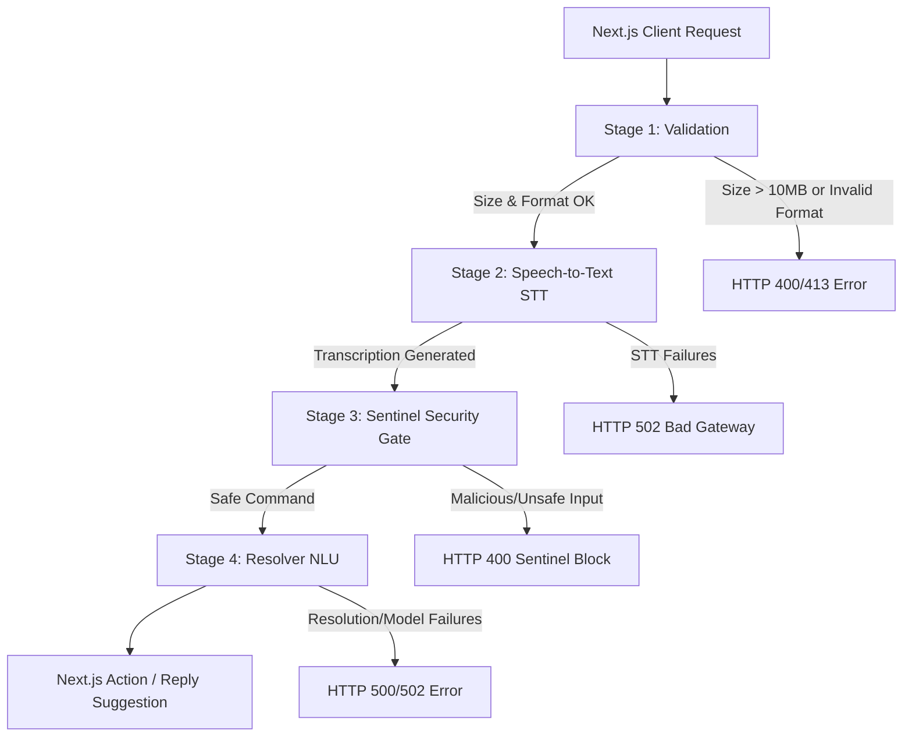

# Project Context: Voice AI FastAPI Microservice

## 1. Project Overview
This repository contains the **Voice AI FastAPI Microservice** (often referred to as the **AI Brain** or **Voice Service**). It is a stateless Python backend designed to process voice inputs and natural language commands. 

This service acts as the backend for the parent Next.js-based markdown notetaking workspace (`Markdown-Notetaking-App-with-Agentic-AI-intergration`). Together, they form a graduation thesis capstone project (**KLTN** - Khóa Luận Tốt Nghiệp) focused on an agentic-AI-assisted productivity environment. The microservice translates spoken Vietnamese or English audio (or pre-transcribed text) into structured JSON mutations or conversational responses.

---

## 2. Core Architecture & 4-Stage Pipeline
The core request handling occurs at the `POST /api/v1/voice/process` endpoint. It processes incoming payloads sequentially through a robust four-stage pipeline:



### Stage 1: Validation
- **Size Limit**: Rejects payloads exceeding **10MB** (returns HTTP 413).
- **MIME-Type Checks**: Supports `audio/webm`, `audio/mp3`, and `audio/mpeg` (normalized to `audio/mp3`). Rejects unsupported formats with HTTP 400.
- **UUID Validation**: Enforces standard UUID parsing for `context_id` and rejects malformed values.

### Stage 2: Speech-to-Text (STT)
- Implemented via a `litellm.Router` configuration allowing transparent fallback and api-key rotation.
- **Primary Provider**: Deepgram Nova-2 (`deepgram/nova-2`), optimized for Vietnamese and low-latency, configured with a 2.5-second timeout.
- **Fallback Provider**: Groq Whisper Large V3 (`groq/whisper-large-v3`), which triggers automatically on Deepgram failure or timeout.
- If both fail, returns HTTP 502.

### Stage 3: Sentinel (Security Gate)
- **Model**: `groq/llama-3.1-8b-instant` via `litellm.acompletion()`.
- Evaluates raw transcripts for prompt injection or malicious misuse.
- **Defense-in-Depth**: Wrap the untrusted transcript inside request-specific random UUID delimiters to prevent model escaping:
  ```
  <<<{random_uuid}_START>>>
  {transcript}
  <<<{random_uuid}_END>>>
  ```
- If flagged unsafe, halts execution and returns HTTP 400 with a generic `"Command not recognized as a workspace action."` response (internal reasoning is logged but never returned to clients).

### Stage 4: Resolver (NLU & Action Resolution)
- **Models**:
  - *Primary*: Gemini 2.5 Flash (`gemini/gemini-2.5-flash`)
  - *Fallback*: Groq Llama 3.3 70B (`groq/llama-3.3-70b-versatile`)
- The Resolver maps the transcript against current workspace context to output a structured JSON action payload.

---

## 3. Directory Structure
```
├── docs/                             # Project documentation
│   ├── AI_MICROSERVICE_CONTRACT.md   # Next.js ↔ FastAPI interface contract (Source of Truth)
│   ├── Context.md                    # Onboarding & architectural guide (This file)
│   ├── PAI_ISSUE_REPORT.md           # Details on fixed STT format & timeout bugs
│   ├── Phase J Implementation Contract V2.md # Spec for Tasks & Calendar extensions
│   └── README_TEST.md                # Guide on test suite execution & mock setups
├── src/                              # Source package
│   ├── static/
│   │   └── tester.html               # Web-based interface for developer manual testing
│   ├── config.py                     # App factory, CORS settings, and LiteLLM Router setup
│   ├── helpers.py                    # Schema validation and payload-building helper functions
│   ├── main.py                       # FastAPI startup logic and static file mounts
│   ├── mock_audio.py                 # Script to generate a dummy silent WebM for testing
│   ├── models.py                     # Pydantic models for request & NLU response verification
│   ├── nlu.py                        # Sentinel, Resolver, and transcribe pipelines
│   ├── routes.py                     # Route registration, error handlers, and middleware
│   └── test_contract.py              # 14 contract integration tests (mock & live modes)
├── .env                              # Secrets & developer credentials (gitignored)
├── .env.example                      # Template for required environment variables
├── requirements.txt                  # Python package specifications
├── run_tests.bat                     # Windows test suite launcher
└── run_tests.sh                      # UNIX test suite launcher
```

---

## 4. Supported Contexts & NLU Actions
The Resolver validates and resolves inputs differently depending on the active workspace context:

| Context Type | Target Action | Behavior & Key Parameters |
| :--- | :--- | :--- |
| **`NOTE`** | `update_note` | Modifies the current note. Params: `content_to_insert`, `action_type` (`append` or `insert_at_cursor`). Returns complete updated note content. |
| **`STACK`** | `add_stack_row` | Appends a row to an Airtable-like stack. Inspects `dynamic_schema` column arrays and maps user-spoken column names to database UUIDs. |
| **`TASK`** | `create_task` | Generates a task. If user requests a subtask and `focusedTaskId` is provided in `task_context`, sets it as `parentId`. Resolves relative dates to UTC ISO-8601. |
| **`CALENDAR`** | `create_calendar_event` | Creates calendar events. Resolves relative times relative to "today". Defaults to a 1-hour duration if not specified. |
| **`none`** | `none` | Used for general chitchat or help queries. Returns natural language conversational response in the `reply` field. |

---

## 5. API Reference & Contracts

### 5.1 Service Health
- **Endpoint**: `GET /health`
- **Response Shape**: `200 OK`
  ```json
  { "status": "ok", "api": "connected" }
  ```

### 5.2 Voice Command Processing
- **Endpoint**: `POST /api/v1/voice/process`
- **Request Encoding**: `multipart/form-data`
- **Fields**:
  - `audio`: (Conditional) WebM or MP3 audio file (Max 10MB). Required if `transcript` is missing.
  - `transcript`: (Conditional) Text string representing pre-transcribed text. Required if `audio` is missing.
  - `context_type`: (Required) `"NOTE"`, `"STACK"`, `"TASK"`, or `"CALENDAR"`.
  - `context_id`: (Required) Valid UUID string.
  - `cursor_position`: (Optional) Integer index offset for cursor placement (Default `0`).
  - `note_state`: (Optional) JSON-serialized note object (`id`, `userId`, `title`, `content`, `createdAt`, `updatedAt`).
  - `dynamic_schema`: (Conditional) JSON-serialized array of stack columns. Required if `context_type` is `"STACK"`.
  - `task_context`: (Optional) JSON-serialized task context containing `focusedTaskId`.

- **Standard Response Shape**:
  ```json
  {
    "transcript": "string",
    "action": "update_note" | "add_stack_row" | "create_task" | "create_calendar_event" | "none",
    "updatedData": {} | null,
    "reply": "string" | null,
    "success": true,
    "message": "string"
  }
  ```
  > [!IMPORTANT]
  > **Mutual Exclusivity**: `updatedData` and `reply` are strictly mutually exclusive. If an action response has `updatedData` populated, `reply` must be `null` (and vice-versa).

---

## 6. Interaction Paradigm (BFF Interface)
The microservice strictly enforces a **suggestion-only** pattern:
1. The FastAPI service has **no database connection** and does not write or read from PostgreSQL directly.
2. It processes user audio/context and returns a proposed mutation payload to the Next.js client.
3. The Next.js client presents the proposal via a **Confirmation Gate**:
   - For `update_note`: Editor displays inline highlights (green insertions, red strikethrough deletions). Hitting **Enter** accepts; **Escape** discards.
   - For `add_stack_row`: Table renders the new row with a yellow "AI Suggested" highlight. Hitting **Accept** writes it to DB; **Discard** deletes it from memory.
4. Conversational replies (`action: "none"`) bypass the gate and display directly inside the sliding right-hand AI Side-Panel.

---

## 7. Configuration & Environment Setup
A `.env` file must exist in the root containing:
```env
DEEPGRAM_API_KEY="your-deepgram-api-key"
GROQ_API_KEY="your-groq-api-key"
GEMINI_API_KEY="your-gemini-api-key"

# Optional/Local Override Configs:
OPENAI_API_KEY="optional-openai-key"
ALLOWED_ORIGINS="http://localhost:3000"
SONIOX_API_KEY="optional-soniox-key"
```

### Mock Mode (`MOCK_OPENAI=1`)
For testing pipelines or local development without consuming API credits:
1. Run the service with `MOCK_OPENAI=1`.
2. The server bypasses Whisper/Nova-2 transcription and Sentinel/Resolver LLM calls.
3. Clients send mock instructions via request headers:
   - `X-Mock-Transcript`: The simulated user transcript.
   - `X-Mock-Tool`: The simulated resolver output action (e.g., `update_note`, `add_stack_row`).
   - `X-Mock-Args`: JSON string containing mock parameter values matching the action shape.

---

## 8. Verification & Testing Workflow
The project contains 14 deterministic integration tests verifying request validations, schema mappings, error codes (400, 413, 502), and fallback states.

To execute tests on Windows:
```cmd
.\run_tests.bat
```
This script configures a temporary virtual environment, installs dependencies, boots Uvicorn in background mock-mode, executes `src/test_contract.py`, and terminates the Uvicorn process.

For manual developer validation:
1. Start the server locally: `uvicorn src.main:app --host 127.0.0.1 --port 8000`
2. Open `http://localhost:8000/tester` in a web browser.
3. Toggle context types, mock text inputs, or record voice notes directly from the browser microphone to audit NLU responses and simulated Next.js payloads.
